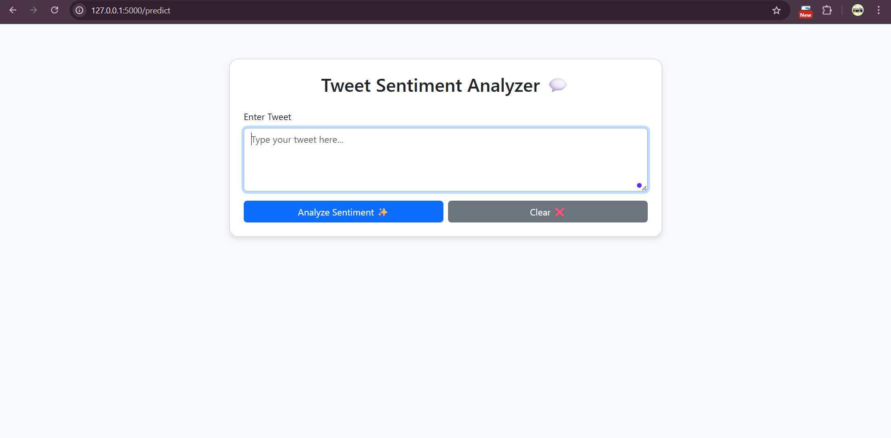
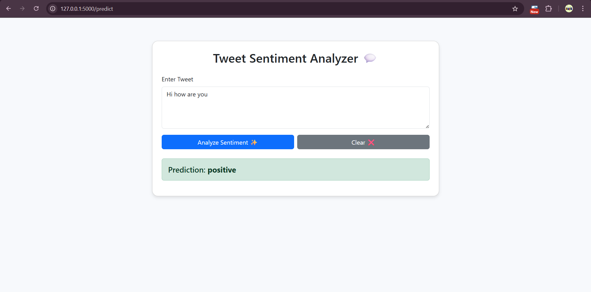

# 🐦 Twitter Sentiment Analysis

This project performs sentiment analysis on tweets using Machine Learning and NLP techniques.

---

## 📌 Features

1. pandas for Dataset (CSV files)
2. Text preprocessing and cleaning  
3. Sentiment classification using Machine Learning  
4. Visual representation of sentiment analysis results  

---

## 📦 Technologies Used

- Python - Flask
- Dataset from Kaggle
-  NLTK (for sentiment analysis)  
- Matplotlib / Seaborn (for visualization)  

---

## 🚀 How to Use

```bash
# Clone the repository
git clone https://github.com/PRRIYAAA/TwitterSentimentAnalysis.git
cd TwitterSentimentAnalysis

# Install dependencies
pip install -r requirements.txt

# 🐦 Twitter Sentiment Analysis

[](https://github.com/PRRIYAAA/TwitterSentimentAnalysis/blob/main/LICENSE)
[](https://github.com/PRRIYAAA/TwitterSentimentAnalysis/stargazers)

A Python-based project that uses **Natural Language Processing (NLP)** and **Machine Learning** to analyze the sentiment of tweets — whether they are **positive**, **negative**, or **neutral**.

---

## 📸 Demo

> _Sentiment classification on tweets related to trending topics:_

  


---

## 🚀 How to Run

```bash
git clone https://github.com/PRRIYAAA/TwitterSentimentAnalysis.git
cd TwitterSentimentAnalysis

python app.py 
pip install -r requirements.txt

##DEMO


